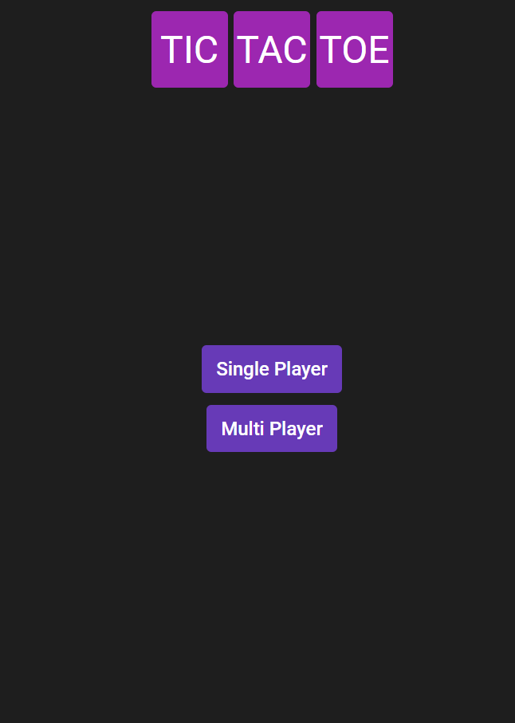
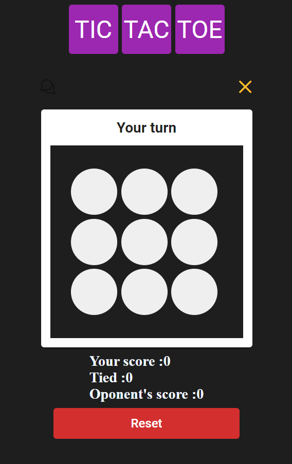
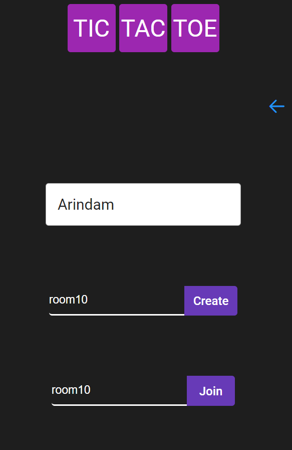
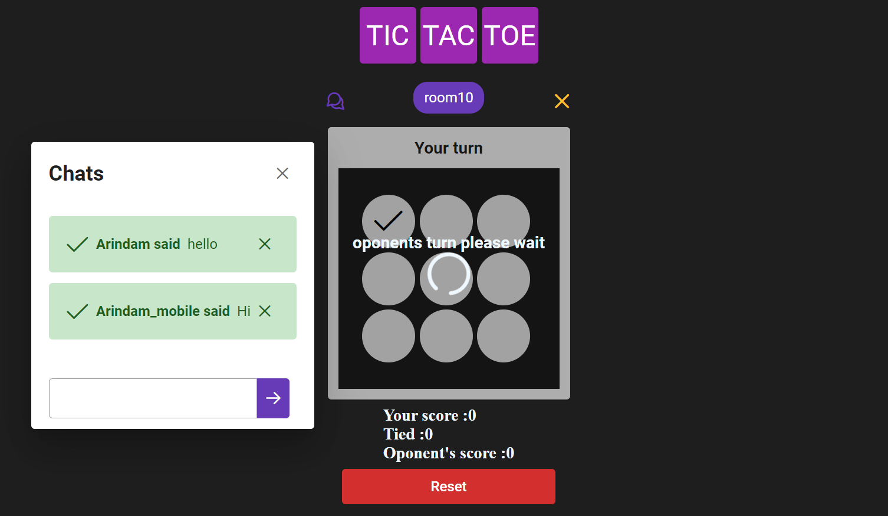

# TicTacToe

A small open source singleplayer and multiplayer game project
.
## single player version.here you can play it with a BOT.
.
## Multiplayer Version.

here you have to enter your name on the top text input box
and then enter any room id to create or to join a room

here You can play it with your friends and also can chat using chat section

frontend build is uploaded in netlify and the node socket server is running in my heroku account.

this version is still has many bugs in it so i'm working on it.

This project was generated with [Angular CLI](https://github.com/angular/angular-cli) version 10.1.0.

## Developer Contact
Arindam Dutta
mail: darindam507@gmail.com
## Development server

Run `ng serve` for a dev server. Navigate to `http://localhost:4200/`. The app will automatically reload if you change any of the source files.

## Code scaffolding

Run `ng generate component component-name` to generate a new component. You can also use `ng generate directive|pipe|service|class|guard|interface|enum|module`.

## Build

Run `ng build` to build the project. The build artifacts will be stored in the `dist/` directory. Use the `--prod` flag for a production build.

## Running unit tests

Run `ng test` to execute the unit tests via [Karma](https://karma-runner.github.io).

## Running end-to-end tests

Run `ng e2e` to execute the end-to-end tests via [Protractor](http://www.protractortest.org/).

## Further help

To get more help on the Angular CLI use `ng help` or go check out the [Angular CLI README](https://github.com/angular/angular-cli/blob/master/README.md).
